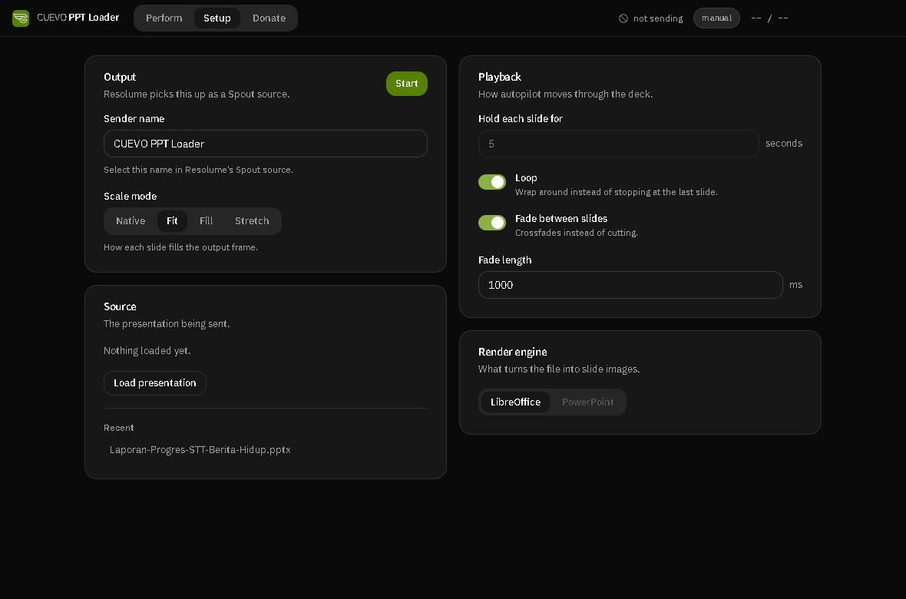
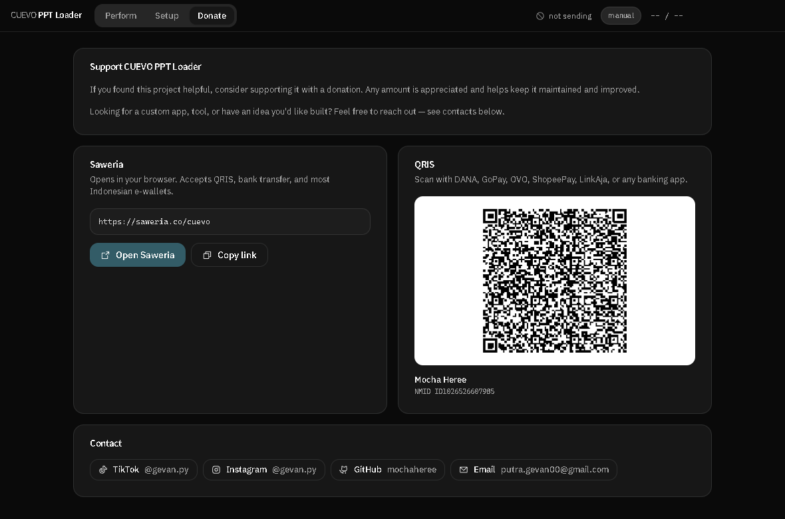

# CUEVO PPT Loader

Loads a PowerPoint file and sends its slides into Resolume Arena as a live
Spout source — prev/next, autopilot, crossfades, loop — as an in-house
alternative to paid FFGL "PPT loader" plugins.

Electron + React + Tailwind v4. Windows only: Spout is a Windows-specific
GPU texture-sharing API, and the alternate render engine drives Microsoft
PowerPoint over COM.


*Perform is the whole job during a show: the slide, prev/next, and autopilot.
Everything you'd only touch once — Spout, scale mode, engine — lives in Setup.*

---

## Install

**Just want to use it** — grab the installer from [Releases](../../releases)
and run it.

**From source:**

```bash
git clone <this-repo>
cd ppt-loader
npm install
npm run build-native   # compiles the Spout sender addon (see Requirements)
```

Two terminals to run it in dev:

```bash
npm run react-dev   # Terminal 1 — Vite on port 5175
npm run dev          # Terminal 2 — the Electron window
```

To build your own installer:

```bash
npm run react-build
npm run build          # NSIS installer + portable exe land in release/
```

If that fails with `EPERM: operation not permitted, rename ... win-unpacked`,
something is holding a handle on the output folder mid-extraction — usually an
editor's file watcher (VS Code), Explorer, or the Windows Search Indexer
reacting to the couple hundred files Electron's own zip just dropped there, not
antivirus. The build script already retries for up to two minutes; if it still
fails, build outside whatever's watching the repo and move the result in
yourself:

```bash
CUEVO_BUILD_OUTPUT=/c/temp/ppt-loader-release npm run build
```

### Requirements

- **Resolume Arena 7**, with a **Spout** source added pointing at the sender
  name shown in Setup (`CUEVO PPT Loader` by default).
- **LibreOffice** (free) for the default render engine — converts the .pptx to
  a PDF, then rasterizes it. [Download](https://www.libreoffice.org/download/download/).
  No separate PDF tool needed; that step is pure JS (`pdfjs-dist`).
- **Microsoft PowerPoint**, optionally, for the alternate render engine —
  higher fidelity, driven over COM via a bundled PowerShell script. The engine
  picker in Setup disables itself automatically if PowerPoint isn't installed.
- Building from source additionally needs **Visual Studio Build Tools** (the
  "Desktop development with C++" workload) and **Python 3** — `node-gyp`
  compiles the Spout addon against the vendored
  [Spout2](https://github.com/leadedge/Spout2) SDK in `native/spout-sender/`.

---

## What it does



*Everything here is configured once and remembered, the same split BeatSync
uses: Setup is for before the show, Perform is for during it.*

- **Load** a `.pptx` or `.ppt`, converted to per-slide PNGs and cached by file
  hash — reopening an unchanged file is instant.
- **Prev / Next**, or **autopilot** — forward, reverse, or random, at a
  configurable interval, with a crossfade between slides if you want one.
- **Loop**, or stop at the last slide.
- **Scale mode** — Native, Fit, Fill, Stretch — matching how the FFGL
  competitor names the same four behaviours.
- **Spout output** at whatever resolution the offscreen compositor renders at,
  fed by Chromium's own `object-fit` handling rather than hand-rolled pixel
  math.
- Sends a steady low-rate keepalive frame even between slide changes, since a
  Spout receiver connecting mid-idle would otherwise see nothing until the
  next paint.

---

## How it works

```
.pptx --[LibreOffice --headless]--> .pdf --[pdfjs-dist + @napi-rs/canvas]--> PNG per slide
                                                          |
                                                          v
                          offscreen BrowserWindow (object-fit does the scaling)
                                                          |
                                              webContents 'paint' event (BGRA)
                                                          |
                                                          v
                              native Spout sender addon (node-addon-api + SpoutDX)
                                                          |
                                                          v
                                              Resolume Arena's Spout source
```

The PowerPoint engine replaces the first step with a PowerShell script driving
PowerPoint over COM (`scripts/export-pptx.ps1`), exporting each slide to PNG
directly.

Two details worth knowing if you're changing the render path:

**No maintained Spout binding exists for Node or Electron.** There's a
Unity-specific one (`jp.keijiro.klak.spout`) and nothing else current, so
`native/spout-sender/` is a from-scratch `node-addon-api` binding over the
vendored SpoutDX SDK. NDI has a maintained option
(`@stagetimerio/grandiose`) and would have been far less work, but it's
network-framed even on localhost; Spout's zero-copy GPU texture share is the
actual local-machine standard other VJ tools expect.

**Offscreen rendering only repaints on content change**, not continuously —
so a static slide produces exactly one `paint` event, not one every frame. The
`offscreenRenderer.js` keepalive timer resends the last frame at 10fps to
cover a receiver joining mid-idle; without it, opening the Spout source in
Resolume while nothing is actively changing shows a blank receiver.

---

## Honest limitations

- **Windows only.** Spout has no cross-platform equivalent, and the
  PowerPoint engine is COM, which doesn't exist off Windows.
- **The PowerPoint engine is unverified end-to-end.** It was written and
  reviewed against the PowerPoint COM API's documented behaviour, but no
  machine with Office installed was available during development — only the
  "PowerPoint not installed" fallback path has actually been exercised.
  If slide export order or fidelity looks wrong, that's the first place to
  look.
- **Slide animations, transitions, and embedded video don't play.** Each
  slide renders as one static raster, same limitation the paid FFGL
  alternative has — this is inherent to converting to flat images rather than
  keeping the deck live in an Office renderer.
- **LibreOffice needs a moment between conversions.** A dedicated user
  profile per conversion avoids the classic "LibreOffice must be closed
  first" lock, but very rapid repeated loads of different files can still
  race with it.
- **The Spout addon is hand-written**, not a widely-used library — it's
  covered by manual testing (a solid-color test pattern and real decks
  confirmed live in Resolume) but hasn't seen the mileage a maintained
  package would have.
- Packaging has only been exercised as an unsigned build; Windows SmartScreen
  will warn on first run of the installer until it picks up enough reputation
  or a code-signing certificate is added.

---

## Donate



If this saved you the €10 the FFGL version costs, or more importantly the
time reimplementing it yourself would have taken — the **Donate** tab has a
Saweria link, QRIS, and contact info.

---

## Layout

```
src/
  main/
    index.js            Electron main: window, IPC handlers, the slide:// protocol
    converter.js         pptx -> PNG, both render engines, file-hash caching
    offscreenRenderer.js Offscreen compositor -> Spout frame feed, keepalive
    offscreen.html        Two-layer crossfade page the compositor drives
    slideEngine.js        Autopilot/loop/duration state machine
    spout.js              Thin wrapper over the native addon
  preload.cjs            contextBridge -> window.api
  renderer/
    App.jsx               Perform / Setup / Donate tabs
    components/ui/        Button, Card, Field, Input, Toggle, Badge, Segmented
native/
  spout-sender/
    src/spout_sender.cc   node-addon-api binding: create / sendFrame / close
    spout-sdk/            Vendored SpoutDX sources (see LICENSE inside)
scripts/
  export-pptx.ps1         PowerPoint COM export, driven from converter.js
  build-installer.mjs     electron-builder wrapper with the EPERM retry above
  spout-test.mjs           Sends a test pattern over Spout with no app UI involved
```

Built on the same design system as CUEVO BeatSync — shadcn preset `b7PaZO816h`
(style Vega, base Neutral, radius Large, Source Sans 3 + IBM Plex Sans, bundled
rather than fetched from Google), the same hidden-title-bar/native-overlay
window chrome, and the same Perform/Setup split. The brand colour here is
`#568203` rather than BeatSync's teal — see the comment in
[`app.css`](src/renderer/app.css) for the contrast numbers behind that choice.
